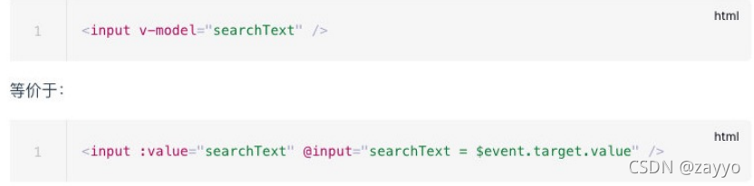

# v-model的详细讲解

### v-model是什么？

v-model 是Vue框架的一种内置的API指令，本质是一种语法糖写法。它负责监听用户的输入事件以更新数据，并对一些极端场景进行一些特殊处理。

### 为什么使用v-model？

v-model指令可以在表单 input、textarea以及select元素上创建双向数据绑定它会根据控件类型自动选取正确的方法来更新元素。尽管有些神奇，但 v-model 本质上不过是语法糖，它负责监听用户的输入事件来更新数据，并在某种极端场景下进行一些特殊处理；

### 什么场景下会使用v-model？

表单提交是开发中非常常见的功能，也是和用户交互的重要手段：比如用户在登录、注册时需要提交账号密码；比如用户在检索、创建、更新信息时，需要提交一些数据； 这些都要求我们可以在代码逻辑中获取到用户提交的数据，我们通常会使用v-model指令来完成

### 示例：v-model的基本使用


#### v-model的原理

官方有说到，v-model的原理其实是背后有两个操作：

**1、v-bind绑定value属性的值；**
**2、v-on绑定input事件监听到函数中，函数会获取最新的值赋值到绑定的属性中；**



#### v-model是双向绑定吗？

是的
你可以用 v-model 指令在表单 、 及 元素上创建双向数据绑定。 —— vue2官方文档

#### v-model 是单向数据流吗？

是的，
虽然官方没有明确表示这点，但我们可以捋一捋两者的关系。

#### 什么是单项数据流？

父组件可以向值组件传递数据,并且改变值组件的值,而子组件不能改变父组件传递给它的 prop 属性，官方推荐的做法是它抛出事件，通知父组件自行改变绑定的值。

#### v-model 的做法是怎样的？

v-model 做法完全符合单项数据流。甚至于，它给出了一种在命名和事件定义上的规范。
众所周知 .sync 修饰符是单向数据流的另一个典型范式。


##### 单向数据流：

总结起来其实也就8个字：数据向下，事件向上。

#### v-model如何绑定表单类型:

那接下来，我们再来看一下v-model是如何绑定一下其他的表单类型：textarea、checkbox、radio、select等属性的

v-model绑定textarea


我们来看一下绑定textarea


  <div class="demo">
    <textarea v-model="article" cols="30" rows="10"> </textarea>
    <h2>article当前的值是：{{ article }}</h2>
  </div>
```php+HTML
export default {
  name: 'demo',
  data () {
    return {
      article: "a"
    }
  }
}
```

效果：


##### v-model绑定checkbox

我们来看一下v-model绑定checkbox：单个勾选框和多个勾选框

**·** 单个勾选框：v-model即为布尔值。此时input的value并不影响v-model的值。
**·** 多个复选框：当是多个复选框时，因为可以选中多个，所以对应的data中属性是一个数组。当选中某一个时，就会将input的value添加到数组中。
单选框示例：


```php+HTML
export default {
  name: 'demo',
  data () {
    return {
      isAgree: "true"
    }
  }
}

```

效果：


```php+HTML
  <!-- 一般对应数组类型 -->
      <input type="checkbox" v-model="sport" value="篮球" />篮球
      <input type="checkbox" v-model="sport" value="足球" />足球
      <input type="checkbox" v-model="sport" value="羽毛球球" />羽毛球球
      <input type="checkbox" v-model="sport" value="兵乓球" />兵乓球
      您的爱好有：{{ sport }}

```

```php+HTML
export default {
  name: 'demo',
  data () {
    return {
      message: "内容",
      sex: '',
      // 当要 默认选中时要填入值即可 例：sex='男'
      // agree: false,
      sport: [],
      // fruits: '',
      // fruits2: [],
      // hobbies: [],
      // origintobbies: ["篮球", "足球", "乒乓球", "羽毛球", "桌球"],
      // age: 0,
      // name: ''

    }
  }
}
```

效果示例：


##### v-model绑定radio

v-model绑定radio，用于选择其中一项；


效果示例：


##### v-model绑定select

和checkbox一样，select也分单选和多选两种情况。

单选：只能选中一个值，v-model绑定的是一个值。当我们选中option中的一个时，会将它对应的value赋值到fruit中；
多选：可以选中多个值，v-model绑定的是一个数组。当选中多个值时，就会将选中的option对应的value添加到数组fruit中；


<select name="abc" v-model="fruits2" multiple>
        <option value="香蕉">香蕉</option>
        <option value="苹果">苹果</option>
        <option value="橙子">橙子</option>
        <option value="榴莲">榴莲</option>
      </select>
```php+HTML
export default {
  name: 'demo',
  data () {
  return {
       message: "内容",
       sex: '',
      //  当要 默认选中时要填入值即可 例：sex='男',
       agree: false,
       sport: [],
      fruits: '',
       fruits2: [],
       hobbies: [],
       origintobbies: ["篮球", "足球", "乒乓球", "羽毛球", "桌球"],
       age: 0,
       name: ''
  }
  }
}
```

效果示例：


效果示例：


#### v-model的值绑定

目前我们在前面的案例中大部分的值都是在template中固定好的：比如gender的两个输入框值male、female；比如hobbies的三个输入框值basketball、football、tennis.

在真实开发中，我们的数据可能是来自服务器的，那么我们就可以先将值请求下来，绑定到data返回的对象中，再通过v-bind来进行值的绑定，这个过程就是值绑定。这里不再给出具体的做法，因为还是v-bind的使用过程。

#### v-model修饰符 - lazy

#### lazy修饰符是什么作用呢？

默认情况下，v-model在进行双向绑定时，绑定的是input事件，那么会在每次内容输入后就将最新的值和绑定的属性进行同步；，如果我们在v-model后跟上lazy修饰符，那么会将绑定的事件切换为 change 事件，只有在提交时（比如回车）才会触发


```html
      <!-- 修饰符    lazy/number/trim -->
      <!-- lazy  失去焦点后才改变点击enter-->
      <!-- 口默认情况下, V- model默认是在input事件中同步输入框的数据的。口也就是说, - -旦有数据发生改变对应的data中的数据就会自动发生 改变。口lazy修饰符可以让数据在失去焦点或者回车时才会更新:-->
      <input type="text" v-model.lazy="message" />
      <br />
      {{ message }}

```


```html
export default {
  name: 'demo',
  data () {
    return {
       message: "内容",
       sex: '',
      //  当要 默认选中时要填入值即可 例：sex='男',
       agree: false,
       sport: [],
      fruits: '',
       fruits2: [],
       hobbies: [],
       origintobbies: ["篮球", "足球", "乒乓球", "羽毛球", "桌球"],
       age: 0,
       name: ''

    }
  }
}

```


效果示例：


##### v-model修饰符 - number

我们先来看一下v-model绑定后的值是什么类型的：message总是string类型，即使在我们设置type为number也是string类型；


如果我们希望转换为数字类型，那么可以使用 .number 修饰符：


另外，在我们进行逻辑判断时，如果是一个string类型，在可以转化的情况下会进行隐式转换的：
下面的score在进行判断的过程中会进行隐式转化的


效果示例：


##### v-model修饰符 - trim

如果要自动过滤用户输入的守卫空白字符，可以给v-model添加 trim 修饰符


效果示例：


全部示例代码：

```html
<!DOCTYPE html>
<html lang="en">

<head>
    <meta charset="UTF-8">
    <meta http-equiv="X-UA-Compatible" content="IE=edge">
    <meta name="viewport" content="width=device-width, initial-scale=1.0">
    <title>Document</title>
    <!-- 引入Vue -->
    <script src="./vue.min.js"></script>
</head>


<body>
    <div id="app">
        <!-- 表单绑定v-model的双向绑定 
        当我们在输入框输入内容时，因为input中的v-model绑定了message ,所以会实时将输入的内容传递给message , 
        message发生改变。内容传递给message , message发生改变。message的值插入到DOM中,所以DOM会发生响应的改变。0所以,通过v-model实现了双向的绑定。-->
        <input type="text" v-model="message"> {{message}}
        <br>
        <!-- v-model和radio的结合使用 -->
        <label for="man">
            <input type="radio" value="男" v-model='sex' id="man">男
        </label>
        <label for="girl">
            <input type="radio" value="女" v-model='sex' id="girl">女
        </label> 您选中的是：{{sex}}
        <br>
        <!-- 复选框   一般对应布尔类型-->
        <label for="agree">
            <input type="checkbox" id="agree" v-model="agree">同意
        </label>
        <button :disabled="!agree">下一步</button> 您的选择：{{agree}}

        <br>
        <!-- 一般对应数组类型 -->
        <input type="checkbox" v-model="sport" value="篮球">篮球
        <input type="checkbox" v-model="sport" value="足球">足球
        <input type="checkbox" v-model="sport" value="羽毛球球">羽毛球球
        <input type="checkbox" v-model="sport" value="兵乓球">兵乓球 您的爱好有：{{sport}}

        <br>
        <!-- select  单选-->
        <select name="abc" v-model='fruits'>
            <option value="香蕉">香蕉</option>
            <option value="苹果">苹果</option>
            <option value="橙子">橙子</option>
            <option value="榴莲">榴莲</option>
        </select> 您选中的水果是{{fruits}}

        <br>
        <br>

        <!-- 多选 -->
        <select name="abc" v-model="fruits2" multiple>
            <option value="香蕉">香蕉</option>
            <option value="苹果">苹果</option>
            <option value="橙子">橙子</option>
            <option value="榴莲">榴莲</option>
        </select>
        <br> 您选中的水果是{{fruits2}}
        <br>
        <!-- 值绑定 -->
        <label v-for="item in origintobbies" :for="item">
            <input type="checkbox" :value="item" :id="item" v-model="hobbies">{{item}}
        </label>
        <br> 您的爱好是{{hobbies}}
        <br>
        <!-- 修饰符    lazy/number/trim -->
        <!-- lazy  失去焦点后才改变点击enter-->
        <!-- 口默认情况下, V- model默认是在input事件中同步输入框的数据的。口也就是说, - -旦有数据发生改变对应的data中的数据就会自动发生 改变。口lazy修饰符可以让数据在失去焦点或者回车时才会更新:-->
        <input type="text" v-model.lazy="message">
        <br> {{message}}
        <br>
        <!-- number 转化为数字类型-->
        <!-- 默认情况下,在输入框中无论我们输入的是字母还是数字,都会被 当做字符串类型进行处理。口但是如果我们]希望处理的是数字类型,那么最好直接将内容当做数字处理。o number修饰符可以让在输入框中输入的内容自动转成数字类型:-->
        <input type="text" v-model.number="age">
        <br> {{age}}--{{typeof age}}
        <br>
        <!-- trim 去除空格 -->
        <!-- trim修饰符可以过滤内容左右两边的空格 -->
        <input type="text " v-model.trim="name">
        <br> {{name}}


    </div>
    <script>
        const app = new Vue({
            el: "#app",
            data: {
                message: "内容",
                sex: '',
                // 当要 默认选中时要填入值即可 例：sex='男'
                agree: false,
                sport: [],
                fruits: '',
                fruits2: [],
                hobbies: [],
                origintobbies: ["篮球", "足球", "乒乓球", "羽毛球", "桌球"],
                age: 0,
                name: ''

            },
            methods: {

            }
        })
    </script>

</body>

</html>


```


