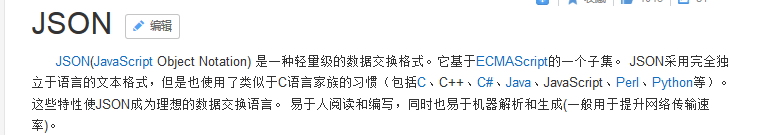

# day30-Ajax

# 今日内容

- JS的Ajax请求(get,post)------>了解
- JQ的Ajax请求(get,post,ajax)------>掌握
- 对象和Json数据之间的相互转换------>掌握
- 案例1: 使用JS的Ajax请求完成用户名异步校验
- 案例2: 使用JQ的Ajax请求完成用户名异步校验
- 案例3: 完成字段补全案例(返回JSON数据)

# 第一章-JS的AJAX

## 1.1  AJAX的概述

#### 什么是AJAX


​	说白了:   **AJax是可以做异步的请求,实现局部刷新一种客户端技术** 

#### 什么是异步


- 同步  

  ​	


- 异步

  
  
  


#### 为什么要学习AJAX   

​	提升用户的体验。(异步)

​	实现页面局部刷新。

​	将部分的代码，写到客户端浏览器。


## 1.2 JS发送Ajax请求【了解】

#### 实现步骤

​	第一步：创建异步请求对象(XMLHttpRequest)。

​	第二步：打开连接。

​	第三步：发送请求。

​	第四步：设置异步请求对象状态发生改变所触发的函数

##### XMLHttpRequest的对象的API

+ 方法

​	**open()** ：打开连接。传递三个参数。第一个是请求方式(GET/POST)，第二个是请求路径，第三个是否是异步的(默认就是异步,不需要这个参数)。

​	**send([post请求参数])**: 发送请求。

​	**setRequestHeader(键,值)**：解决POST请求参数的问题。 key和值 content-type

+ 属性

​	**onreadystatechange**：监听该对象的状态的改变,需要一个函数响应它

​	**readyState：该属性就记录这个对象的状态**。


​	**status：状态码 。**  

​	**responseText:获得字符串形式的响应数据(响应体)。**

​	responseXML :获得 XML 形式的响应数据(响应体)

#### GET请求方式的入门

```javascript
<body>

<span id="spanId">span...</span><br/>
<input type="button" value="js发送ajax请求(get)" onclick="sendAjaxGet()">

</body>
<script>
    // js发送ajax请求---->get方式
    function sendAjaxGet() {
        // 1.创建异步请求对象
        var xmlhttp;
        if (window.XMLHttpRequest) {// code for IE7+, Firefox, Chrome, Opera, Safari
            xmlhttp = new XMLHttpRequest();
        } else {// code for IE6, IE5
            xmlhttp = new ActiveXObject("Microsoft.XMLHTTP");
        }

        // 2.打开连接: open(参数1,参数2),参数1: 设置强求方式(get,post)  参数2: 请求路径url
        xmlhttp.open("GET","ServletDemo1?username=zhangsan&password=123456");

        // 3.发送请求
        xmlhttp.send();

        // 4.设置异步请求对象状态发生改变会触发的函数
        xmlhttp.onreadystatechange = function () {
            alert(xmlhttp.readyState);
            // xmlhttp.readyState==4: 数据接收完毕
            // xmlhttp.status: 响应ok 200
            if (xmlhttp.readyState==4 && xmlhttp.status == 200){
                alert(xmlhttp.responseText);
                // 获得页面span标签对象
                document.getElementById("spanId").innerHTML = xmlhttp.responseText;
            }
        }

    }
</script>
```

```java

/**
 * @Author：pengzhilin
 * @Date: 2021/5/13 9:05
 */
@WebServlet("/ServletDemo1")
public class ServletDemo1 extends HttpServlet {
    protected void doPost(HttpServletRequest request, HttpServletResponse response) throws ServletException, IOException {
        System.out.println("来到了ServletDemo1....");
        // 1.处理乱码
        request.setCharacterEncoding("utf-8");
        response.setContentType("text/html;charset=utf-8");

        // 2.获得请求参数
        String username = request.getParameter("username");
        String password = request.getParameter("password");
        System.out.println("username:"+username+"password:"+password);

        // 3.响应数据到浏览器
        response.getWriter().println("<h1>hello ajax...</h1>");
    }

    protected void doGet(HttpServletRequest request, HttpServletResponse response) throws ServletException, IOException {
        doPost(request, response);
    }
}

```


#### POST请求方式的入门

```javascript
<body>

<span id="spanId">span...</span><br/>
<input type="button" value="js发送ajax请求(get)" onclick="sendAjaxGet()">
<input type="button" value="js发送ajax请求(post)" onclick="sendAjaxPost()">
</body>
<script>
    // js发送ajax请求---->get方式
    function sendAjaxGet() {
        // 1.创建异步请求对象
        var xmlhttp;
        if (window.XMLHttpRequest) {// code for IE7+, Firefox, Chrome, Opera, Safari
            xmlhttp = new XMLHttpRequest();
        } else {// code for IE6, IE5
            xmlhttp = new ActiveXObject("Microsoft.XMLHTTP");
        }

        // 2.打开连接: open(参数1,参数2),参数1: 设置强求方式(get,post)  参数2: 请求路径url
        xmlhttp.open("GET","ServletDemo1?username=zhangsan&password=123456");

        // 3.发送请求
        xmlhttp.send();

        // 4.设置异步请求对象状态发生改变会触发的函数
        xmlhttp.onreadystatechange = function () {
            alert(xmlhttp.readyState);
            // xmlhttp.readyState==4: 数据接收完毕
            // xmlhttp.status: 响应ok 200
            if (xmlhttp.readyState==4 && xmlhttp.status == 200){
                alert(xmlhttp.responseText);
                // 获得页面span标签对象
                document.getElementById("spanId").innerHTML = xmlhttp.responseText;
            }
        }

    }

    // js发送ajax请求---->post方式
    function sendAjaxPost() {
        // 1.创建异步请求对象
        var xmlhttp;
        if (window.XMLHttpRequest) {// code for IE7+, Firefox, Chrome, Opera, Safari
            xmlhttp = new XMLHttpRequest();
        } else {// code for IE6, IE5
            xmlhttp = new ActiveXObject("Microsoft.XMLHTTP");
        }

        // 2.打开连接
        xmlhttp.open("POST","ServletDemo1");

        // 设置content-type请求头,告诉服务器提交了参数
        xmlhttp.setRequestHeader("content-type","application/x-www-form-urlencoded");

        // 3.发送请求:  send([post请求参数])
        xmlhttp.send("username=lisi&password=abcdef");

        // 4.设置异步请求对象状态发生改变触发的函数
        xmlhttp.onreadystatechange = function () {
            // 数据接收完毕,并且响应成功
            if (xmlhttp.readyState == 4 && xmlhttp.status == 200){
                alert(xmlhttp.responseText);
                // 把服务器响应的内容设置到当前页面的标签中(span)
                document.getElementById("spanId").innerHTML = xmlhttp.responseText;
            }
        }

    }
</script>

```

#### 涉及到的API

##### XMLHttpRequest

​	不同的浏览器对该对象的创建的方式不一样，MSIE浏览器，比较早的浏览器，创建这个对象的时候将这个对象封装到ActiveXObject的插件中。像火狐或者谷歌浏览器则直接new出来。

```javascript
function createXmlHttp(){
   var xmlHttp;
   try{ // Firefox, Opera 8.0+, Safari
        xmlHttp=new XMLHttpRequest();
   }catch (e){
	   try{// Internet Explorer
	         xmlHttp=new ActiveXObject("Msxml2.XMLHTTP");
	      }
	    catch (e){
	      try{
	         xmlHttp=new ActiveXObject("Microsoft.XMLHTTP");
	      }
	      catch (e){}
	      }
    }
	return xmlHttp;
 }
```


注意:  JS的Ajax有些繁琐. 我们做项目/工作里面开发 一般很少用JS的Ajax ==会用JQ的Ajax, vue里面的axios==


## 1.3 使用JS的AJAX完成用户名的异步校验 ##

### 1.需求 ###

​	我们有一个网站，网站中都有注册的页面，当我们在注册的页面中输入用户名的时候(失去焦点的时候)，这个时候会提示，用户名是否存在。


### 2.思路分析 ###


```java
注册页面
1.为用户名输入框绑定失去焦点事件
2.在失去焦点事件函数中发送js的ajax请求(服务器)
3.请求成功之后,获得服务器返回的数据
4.把服务器返回的数据设置到标签上


UserServlet
1.处理乱码
2.获得请求参数(用户名)
3.调用service层,传入参数(用户名),得到User对象
4.判断User对象,响应数据到页面


UserService
1.调用dao层,传入用户名,得到user对象
2.返回user对象

UserDao
1.创建QueryRunner对象
2.调用query方法进行查询
3.返回user对象
```


### 3.代码实现

#### 3.1.环境的准备

+    创建数据库和表

     ```mysql
     create database day29;
     use day29;
     create table user(
     	id int primary key auto_increment,
     	username varchar(20),
     	password varchar(20),
     	email varchar(50),
     	phone varchar(20)
     );
     insert into user values (null,'aaa','123','aaa@163.com','15845612356');
     insert into user values (null,'bbb','123','bbb@qq.com','15845612356');
     insert into user values (null,'ccc','123','ccc@163.com','15845612356');
     ```

+    创建包结构

+    创建实体类       

    ```java
       public class User implements Serializable{
           private int id;
           private String username;
           private String password;
           private String email;
           private String phone;
     		//...
       }
    ```
    


+ 导入jar包 (驱动,c3p0,DBUtils)


+ 引入工具类(C3P0Utils),配置文件(c3p0-config.xml)
+ 页面的准备


#### 3.2代码实现

+ 页面

```js
1.为用户名输入框绑定失去焦点事件
2.完成失去焦点事件的函数
<script>
    // 校验用户名是否存在,给出响应的提示
    function checkUsername(obj) {
        // 1.获得用户输入的用户名
        var username = obj.value;
        // 2.在失去焦点事件函数中发送js的ajax请求(服务器)
        // 2.1 创建异步请求对象
        var xmlhttp;
        if (window.XMLHttpRequest) {// code for IE7+, Firefox, Chrome, Opera, Safari
            xmlhttp = new XMLHttpRequest();
        } else {// code for IE6, IE5
            xmlhttp = new ActiveXObject("Microsoft.XMLHTTP");
        }

        // 2.2 打开连接
        xmlhttp.open("GET", "UserServlet?username=" + username);

        // 2.3 发送请求
        xmlhttp.send();

        // 2.4 设置异步请求对象状态发生改变触发的函数
        xmlhttp.onreadystatechange = function () {
            // 3.请求成功之后,获得服务器返回的数据
            if (xmlhttp.readyState == 4 && xmlhttp.status == 200) {
                // 4.把服务器返回的数据设置到标签上
                // alert(xmlhttp.responseText);
                document.getElementById("usernamespan").innerHTML = xmlhttp.responseText;
            }

        }


    }
</script>
```

+ UserServlet

```java
package com.itheima.web;

import com.itheima.bean.User;
import com.itheima.service.UserService;

import javax.servlet.ServletException;
import javax.servlet.annotation.WebServlet;
import javax.servlet.http.HttpServlet;
import javax.servlet.http.HttpServletRequest;
import javax.servlet.http.HttpServletResponse;
import java.io.IOException;

/**
 * @Author：pengzhilin
 * @Date: 2021/5/13 9:55
 */
@WebServlet("/UserServlet")
public class UserServlet extends HttpServlet {
    protected void doPost(HttpServletRequest request, HttpServletResponse response) throws ServletException, IOException {
        System.out.println("来到了UserServlet....");
        // 1.处理乱码
        request.setCharacterEncoding("utf-8");
        response.setContentType("text/html;charset=utf-8");

        // 2.获得请求参数(用户名)
        String username = request.getParameter("username");
        System.out.println("username:"+username);

        // 3.调用service层,传入参数(用户名),得到User对象
        UserService service = new UserService();
        User user = service.checkUsername(username);
        // 4.判断User对象,响应数据到页面
        if (user == null){
            // 用户名不存在,用户名可用(绿色)
            response.getWriter().println("<font color='green'>用户名可用</font>");
        }else{
            // 用户名存在,用户名不可用(红色)
            response.getWriter().println("<font color='red'>用户名不可用</font>");

        }
    }

    protected void doGet(HttpServletRequest request, HttpServletResponse response) throws ServletException, IOException {
        doPost(request, response);
    }
}

```

+ UserServie

```java
package com.itheima.service;

import com.itheima.bean.User;
import com.itheima.dao.UserDao;

import java.sql.SQLException;

/**
 * @Author：pengzhilin
 * @Date: 2021/5/13 9:55
 */
public class UserService {
    // 校验用户名
    public User checkUsername(String username) {
        try {
            // 1.调用dao层,传入用户名,得到user对象
            UserDao dao = new UserDao();
            User user = dao.checkUsername(username);
            // 2.返回user对象
            return user;
        } catch (SQLException e) {
            e.printStackTrace();
            return null;
        }
    }
}

```

+ UserDao

```java
package com.itheima.dao;

import com.itheima.bean.User;
import com.itheima.utils.C3P0Utils;
import org.apache.commons.dbutils.QueryRunner;
import org.apache.commons.dbutils.handlers.BeanHandler;

import java.sql.SQLException;

/**
 * @Author：pengzhilin
 * @Date: 2021/5/13 9:55
 */
public class UserDao {
    // 校验用户名
    public User checkUsername(String username) throws SQLException {
        // 1.创建QueryRunner对象
        QueryRunner qr = new QueryRunner(C3P0Utils.getDataSource());

        // 2.调用查询的方法
        String sql = "select * from user where username = ?";
        User user = qr.query(sql, new BeanHandler<User>(User.class), username);

        // 3.返回结果
        return user;
    }
}

```

### 4.小结

#### 4.1 思路

 


 

# 第二章-JQ的AJAX【重点】

## 2.1 JQ的AJAX介绍

#### 为什么要使用JQuery的AJAX  

​	因为传统(js里面)的AJAX的开发中，AJAX有两个主要的问题：

​	浏览器的兼容的问题 , 编写AJAX的代码太麻烦而且很多都是雷同的。

​	在实际的开发通常使用JQuery的Ajax  ,或者Vue里面的axios

#### JQuery的Ajax的API

| 请求方式            | 语法                                          |
| ------------------- | --------------------------------------------- |
| GET请求             | $.get(url, *[data]*, *[callback]*, *[twsse]*) |
| ==POST请求==        | $.post(url, *[data]*, *[callback]*, *[type]*) |
| ==AJAX请求==        | $.ajax([settings])                            |
| GET请求(3.0新特性)  | $.get([settings])                             |
| POST请求(3.0新特性) | $.post([settings])                            |


## 2.2 JQ的AJAX请求【重点】

#### get()

- get方式,  语法	`$.get(url, [data], [callback], [type]);`

  | 参数名称 | 解释                                                         |
  | -------- | ------------------------------------------------------------ |
  | url      | 请求的服务器端url地址                                        |
  | data     | 发送给服务器端的请求参数，格式可以是key=value，也可以是js对象 |
  | callback | 当请求成功后的回掉函数，可以在函数体中编写我们的逻辑代码     |
  | type     | 预期的返回数据的类型，取值可以是 xml, html, script, json, text, _defaul等 |

- 实例

```js
<body>
<span id="spanId">span...</span><br/>
<input type="button" value="JQ发送ajax请求(get)" id="btn01">

</body>
<script>
    // 为第一个按钮绑定一个点击事件
    $("#btn01").click(function () {
        // 发送ajax请求---->get方式 $.get(url, [data], [callback], [type]);
        // 参数1: 要访问的资源路径
        // 参数2: 提交到服务器的请求参数--->js对象,key=value
        // 参数3: 响应成功后回调的函数
        // 参数4: 预期服务器返回的数据类型
        $.get(
            "ServletDemo1",
            // "username=wangwu&password=123456",
            {username:"zhaoliu",password:"123456"},
            function (result) {
                // 参数result: 名字可以自定义,表示服务器返回的数据
                alert(result);
                // 把返回的数据更新到span标签中
                $("#spanId").html(result);
            },
            "text"
        );

    });
</script>
```

#### post()

- post方式, 语法 `$.post(url, [data], [callback], [type])`

  | 参数名称 | 解释                                                         |
  | -------- | ------------------------------------------------------------ |
  | url      | 请求的服务器端url地址                                        |
  | data     | 发送给服务器端的请求参数，格式可以是key=value，也可以是js对象 |
  | callback | 当请求成功后的回掉函数，可以在函数体中编写我们的逻辑代码     |
  | type     | 预期的返回数据的类型，取值可以是 xml, html, script, json, text, _defaul等 |

- 实例

```js
// 为第二个按钮绑定一个点击事件
    $("#btn02").click(function (){
        // 发送ajax请求-->post方式  $.post(url, [data], [callback], [type]);
        $.post(
            "ServletDemo1",
            {username:"tianqi",password:"abcdef"},
            function (result) {
                alert(result);
                $("#spanId").html(result);
            }
        );
    });
```

#### ajax()

- 语法   `$.ajax([settings])`

  其中，settings是一个js字面量形式的对象，格式是{name:value,name:value... ...}，常用的name属性名如下

  | 属性名称 | 解释                                                         |
  | -------- | ------------------------------------------------------------ |
  | url      | 请求的服务器端url地址                                        |
  | async    | (默认: true) 默认设置下，所有请求均为异步请求。如果需要发送同步请求，请将此选项设置为 false |
  | data     | 发送到服务器的数据，可以是键值对形式，也可以是js对象形式     |
  | type     | (默认: "GET") 请求方式 ("POST" 或 "GET")， 默认为 "GET"      |
  | dataType | 预期的返回数据的类型，取值可以是 xml, html, script, json, text, _defaul等 |
  | success  | 请求成功后的回调函数                                         |
  | error    | 请求失败时调用此函数                                         |

- 实例

```js
// 为第三个按钮绑定一个点击事件
    $("#btn03").click(function () {
        // 发送ajax请求---->ajax方式 $.ajax([settings])--->参数键值对的形式,eg: {key:value,key:value,...}
        // url: 请求的服务器端url地址
        // data:发送到服务器的数据，可以是键值对形式，也可以是js对象形式
        // async: 默认异步(true),同步设置为false
        // type: 请求方式,GET\POST
        // dataType: 预期的返回数据的类型，一般是:json,text,html,...
        // success: 请求成功后的回调函数
        // error: 请求失败后的回调函数
        $.ajax({
            url:"ServletDemo1",
            // data:"username=wangba&password=abcdef",
            data:{username:"wangba",password:"1234567"},
            type: "POST",
            dataType:"text",
            success:function (result) {
                // 参数result:名字可以自定义,表示服务器返回的数据
                alert(result);
                $("#spanId").html(result);
            },
            error:function (error) {
                // 参数error:名字可以自定义,包含了一下错误信息
                // console.log(error);
                // var s = JSON.stringify(error);
                // $("#spanId").html(s);

                if (error.status == 500){
                    $("#spanId").html("<h1>服务器异常 500</h1>");

                }
            }
        });
    });
```


## 2.3 使用JQ的Ajax完成用户名异步校验

### 1.需求分析

​	我们有一个网站，网站中都有注册的页面，当我们在注册的页面中输入用户名的时候，这个时候会提示，用户名是否存在。

​	

###  2,思路分析


0. 导入jq库
1. 给用户名输入框设置失去焦点事件

```
inputEle.blur(function(){
	//1.获得用户输入的用户名
	//2.发送Ajax请求UserServlet, 携带用户名
	//3.获得响应的结果, 判断, 给用户提示

});
```

2. 创建UserServlet

```
//1.获得请求参数(用户名)
//2.调用业务
//3.响应
```

3. 创建UserService

```
public boolean checkUsername(String username){
	//1.调用Dao 根据用户名查询数据库
	//2.判断 返回【true 存在; false 不存在】
} 
```

4. 创建UserDao

```
SELECT * FROM user WHERE username = ?
```


### 3.代码实现

+ 前端

```js
<script>
    // 使用jquery方式为用户名输入框绑定失去焦点事件
    $("#username").blur(function () {
        // 1.获得用户输入的用户名
        var username = this.value;

        // 2.在失去焦点事件函数中发送Ajax请求
        $.post(
            "UserServlet",
            {username: username},
            function (result) {
                // 3.回调函数中, 获得服务器返回的数据
                alert(result);
                // 4.把返回的数据更新到页面
                $("#usernamespan").html(result);
            }
        );

    });
</script>
```

- 服务器代码
  - 使用之前js完成用户名异步校验的代码即可

### 4.小结

1. JQ的Ajax

```
$.post(请求路径,[请求参数],[function(result){}],[响应结果的类型]);
```


## 2.4 json的定义和解析【重点】 

#### json简介



- 用我们自己的话来说:  JSON就是一个容易生成和解析的数据格式; 

  ​		                                常用作客户端(前端,IOS,安卓)和服务器(JavaEE)之间的数据交换

#### 语法介绍

* 定义方式：
  * 对象形式：`{key:value,key:value...}`
    + key只能是字符串
    + value是任意的合法数据类型
    + 多个之间使用,隔开,最后一个,不写
    + key和value之间使用:连接
  * 数组形式：`[element1, element2, ...]`
    - 数组元素可以是任意合法数据类型
  * 混合(嵌套)形式：以上两种类型任意混合
    * json对象的value，可以是任意类型，当然也可以是数组
    * 数组里的element，可以是任意类型，当然也可以是json对象
* 解析语法：
  * 获取json对象里的value值：`json对象.key`
  * 获取数组里指定索引的元素：`数组[索引]`

####  使用示例

* 对象形式

```js
 // 对象形式的json: {key:value,key:value,...}
// key是字符串类型,value可以是任意合法的数据类型
var p = {"name":"zhangsan","age":18};

// 1.需求:获取p json数据中的age--->18
console.log("第一个p的age:"+p.age);
```

* 数组形式

```js
// 数组形式的json: [e1,e2,e3,...]
// 元素可以是任意类型
var pp = [{"name":"zhangsan","age":18},{"name":"lisi","age":19},"哈哈哈",19];

 // 2.需求:获取pp中第二个元素的name--->lisi
console.log("第二个pp中第二个元素的name: "+pp[1].name);
```

* 混合形式

```js
  // 混合类型: 对象形式的json的value可以是任意类型,数组元素可以是类型类型
var ppp = {"p1":{"name":"zhangsan","age":18},"p2": [{"name":"lisi","age":19},{"name":"wangwu","age":20},"哈哈哈",19]};

// 3.需求:获取ppp中第三个人的name--->wangwu
console.log("ppp中第三个人的name:"+ppp.p2[1].name);
```

#### 小结

1. JSON: 一种容易生成和解析的数据格式, 通常用作数据的交换

 

2. JSON格式
   + JSON对象 {key:value,key:value}
     + key是字符串
     + value是任意的合法数据类型
   + JSON数组  [ele,ele...]
   + 嵌套: 对象和数组的嵌套


## 2.5 Jackson转换工具 

#### 常见工具类

* 在Ajax使用过程中，服务端返回的数据可能比较复杂，比如`List<User>`；这些数据通常要转换成json格式，把**json格式字符串**返回客户端
* 常见的转换工具有：
  * Jackson：SpringMVC内置的转换工具
  * jsonlib：Java提供的转换工具
  * gson：google提供的转换工具  
  * fastjson：Alibaba提供的转换工具

#### Jackson的API介绍

* Jackson提供了转换的核心类：`ObjectMapper`
* `ObjectMapper`的构造方法：无参构造
* `ObjectMapper`的常用方法：

| 方法                                              | 说明                                     |
| ------------------------------------------------- | ---------------------------------------- |
| `String writeValueAsString(Object obj)`           | 把obj对象里的数据转换成json格式          |
| `readValue(String json, Class type)`              | 把json字符串，还原成type类型的Java对象   |
| `readValue(String json, TypeReference reference)` | 把json字符串，还原成带泛型的复杂Java对象 |

* 其中`TypeReference`，`com.fasterxml.jackson.core.type.TypeReference`
  * 是一个抽象类，用于配置完整的泛型映射信息，避免泛型丢失的问题。用法示例：

``` java
// List<Integer> 类型的映射信息
TypeReference ref1 = new TypeReference<List<Integer>>() {};

// List<User> 类型的映射信息
TypeReference ref2 = new TypeReference<List<User>>() {};

// Map<String,User> 类型的映射信息
TypeReference ref3 = new TypeReference<Map<String,User>>(){};
```


#### Jackson使用示例

##### java对象转成JSON[重点]

**步骤:**

1. 导入jar包

 

2. 创建ObjectMapper对象
3. 调用`writeValueAsString( Object obj)`


**实现**

```java

import com.fasterxml.jackson.core.JsonProcessingException;
import com.fasterxml.jackson.databind.ObjectMapper;
import com.itheima.bean.User;
import org.junit.Test;

import java.util.ArrayList;
import java.util.HashMap;
import java.util.List;
import java.util.Map;

/**
 * @Author：pengzhilin
 * @Date: 2021/5/13 11:55
 */
public class Demo1_Jackson {
    // 对象转换为json格式的字符串: String writeValueAsString(Object obj)
    @Test
    public void test1() throws JsonProcessingException {
        // 创建User对象
        User user = new User(1,"zhangsan","123456","zhangsan@itheima.com","13823456789");
        // 创建ObjectMapper类
        ObjectMapper mapper = new ObjectMapper();
        // 把user对象转换为json格式的字符串
        String json = mapper.writeValueAsString(user);
        // 打印json字符串数据
        System.out.println(json);
        // {"id":1,"username":"zhangsan","password":"123456","email":"zhangsan@itheima.com","phone":"13823456789"}
    }

    // Map集合转换为json格式的字符串
    @Test
    public void test2() throws JsonProcessingException {
        // 创建User对象
        User user = new User(1,"zhangsan","123456","zhangsan@itheima.com","13823456789");

        // 创建map集合
        Map<String,Object> map = new HashMap<>();
        map.put("akey",user);
        map.put("bkey", "bbb");
        map.put("ckey", "ccc");

        // 创建ObjectMapper类
        ObjectMapper mapper = new ObjectMapper();
        // 把map集合转换为json格式的字符串
        String json = mapper.writeValueAsString(map);

        // 打印json
        System.out.println(json);
        // {"ckey":"ccc","akey":{"id":1,"username":"zhangsan","password":"123456","email":"zhangsan@itheima.com","phone":"13823456789"},"bkey":"bbb"}
    }

    // List集合转换为json格式的字符串
    @Test
    public void test3() throws JsonProcessingException {
        // 创建User对象
        User user1 = new User(1,"zhangsan","123456","zhangsan@itheima.com","13823456789");
        User user2 = new User(2,"lisi","123456","lisi@itheima.com","13823456789");
        User user3 = new User(3,"wangwu","123456","wangwu@itheima.com","13823456789");

        // 创建List集合
        List<User> list = new ArrayList<>();
        list.add(user1);
        list.add(user2);
        list.add(user3);

        // 创建ObjectMapper类
        ObjectMapper mapper = new ObjectMapper();

        // 把list集合转换为json格式的字符串
        String json = mapper.writeValueAsString(list);

        // 打印json
        System.out.println(json);

        // [{"id":1,"username":"zhangsan","password":"123456","email":"zhangsan@itheima.com","phone":"13823456789"},{"id":2,"username":"lisi","password":"123456","email":"lisi@itheima.com","phone":"13823456789"},{"id":3,"username":"wangwu","password":"123456","email":"wangwu@itheima.com","phone":"13823456789"}]
    }
}

```

##### json转成Java对象

**步骤:**

1. 导入jar包

 

2. 创建ObjectMapper对象
3. 调用readValue(String json, Class type)或者`readValue(String json, TypeReference reference)`

**实现**

```java

import com.fasterxml.jackson.core.type.TypeReference;
import com.fasterxml.jackson.databind.ObjectMapper;
import com.itheima.bean.User;
import org.junit.Test;

import java.io.IOException;
import java.util.List;
import java.util.Map;

/**
 * @Author：pengzhilin
 * @Date: 2021/5/13 11:55
 */
public class Demo2_Jackson {
   // json转换为java对象: readValue(String json,Class c) 或者 readValue(String json, TypeReference reference)

    // json数据转换为user对象
    @Test
    public void test1() throws IOException {
        // 定义json数据
        String json = "{\"id\":1,\"username\":\"zhangsan\",\"password\":\"123456\",\"email\":\"zhangsan@itheima.com\",\"phone\":\"13823456789\"}";

        // 2.创建ObjectMapper对象
        ObjectMapper mapper = new ObjectMapper();

        // 3.调用readValue方法
        User user = mapper.readValue(json, User.class);

        // 4.打印对象
        System.out.println(user);
        // User{id=1, username='zhangsan', password='123456', email='zhangsan@itheima.com', phone='13823456789'}
    }


    // json数据转换为map集合
    @Test
    public void test2() throws IOException {
        // 定义json数据
        String json = "{\"ckey\":\"ccc\",\"akey\":{\"id\":1,\"username\":\"zhangsan\",\"password\":\"123456\",\"email\":\"zhangsan@itheima.com\",\"phone\":\"13823456789\"},\"bkey\":\"bbb\"}";

        // 2.创建ObjectMapper对象
        ObjectMapper mapper = new ObjectMapper();

        // 3.调用readValue方法
        Map<String,Object> map = mapper.readValue(json, Map.class);

        // 4.打印map集合
        //System.out.println(map);

        // 4.遍历map集合
        for (String key : map.keySet()) {
            // 取值
            Object value = map.get(key);
            System.out.println(key+":"+value);
        }
    }

    // json数据转换为list集合
    @Test
    public void test3() throws IOException {
        // 1.定义json数据
        String json = "[{\"id\":1,\"username\":\"zhangsan\",\"password\":\"123456\",\"email\":\"zhangsan@itheima.com\",\"phone\":\"13823456789\"},{\"id\":2,\"username\":\"lisi\",\"password\":\"123456\",\"email\":\"lisi@itheima.com\",\"phone\":\"13823456789\"},{\"id\":3,\"username\":\"wangwu\",\"password\":\"123456\",\"email\":\"wangwu@itheima.com\",\"phone\":\"13823456789\"}]";

        // 2.创建ObjectMapper对象
        ObjectMapper mapper = new ObjectMapper();

        // 3.调用readValue(String json,Class c)方法
        List<User> list = mapper.readValue(json, List.class);

        // 4.打印集合
        System.out.println(list);// 不报错

        // 5.循环遍历
       /* for (User user : list) {// 报错
            System.out.println(user);
        }*/
    }


    // json数据转换为list集合
    @Test
    public void test4() throws IOException {
        // 1.定义json数据
        String json = "[{\"id\":1,\"username\":\"zhangsan\",\"password\":\"123456\",\"email\":\"zhangsan@itheima.com\",\"phone\":\"13823456789\"},{\"id\":2,\"username\":\"lisi\",\"password\":\"123456\",\"email\":\"lisi@itheima.com\",\"phone\":\"13823456789\"},{\"id\":3,\"username\":\"wangwu\",\"password\":\"123456\",\"email\":\"wangwu@itheima.com\",\"phone\":\"13823456789\"}]";

        // 2.创建ObjectMapper对象
        ObjectMapper mapper = new ObjectMapper();

        // 3.调用readValue(String json,TypeReference tr)方法
        List<User> list = mapper.readValue(json, new TypeReference<List<User>>(){});

        // 4.打印集合
        System.out.println(list);// 不报错

        // 5.循环遍历
        for (User user : list) {// 不报错
            System.out.println(user);
        }
    }

}

```

### 小结

1. JackSon: json和java对象互相转换的工具,SpringMVC默认的json转换器

2. java对象转json(导入jar)

   + 创建ObjectMapper对象
   + 调用writeValueAsString(Object obj)

3. json转java对象(导入jar)

   + 创建ObjectMapper对象
   + 调用readValue(String json,Class clazz)

   


## 2.6 fastjson转换工具

####  fastjson的API介绍

* fastjson提供了核心类：`JSON`
* `JSON`提供了一些常用的==**静态**==方法：

| 方法                                                | 说明                                     |
| --------------------------------------------------- | ---------------------------------------- |
| `String toJSONString(Object obj)`                   | 把obj对象里的数据转换成json格式          |
| `parseObject(String json, Class type)`              | 把json字符串，还原成type类型的Java对象   |
| `parseObject(String json, TypeReference reference)` | 把json字符串，还原成带泛型的复杂Java对象 |

* 其中`TypeReference`：`com.alibaba.fastjson.TypeReference`
  * 是一个抽象类，用于配置完整的泛型映射信息，避免泛型丢失的问题。用法示例：

``` java
// List<Integer> 类型的映射信息
TypeReference ref1 = new TypeReference<List<Integer>>() {};

// List<User> 类型的映射信息
TypeReference ref2 = new TypeReference<List<User>>() {};

// Map<String,User> 类型的映射信息
TypeReference ref3 = new TypeReference<Map<String,User>>(){};
```

#### fastjson的使用示例

##### 3.2.1 java对象转成json[重点]

**步骤**


1. 导入jar包

   

2. 调用JSON.toJSONString(Object obj);

**实现**

```java

/**
 * @Author：pengzhilin
 * @Date: 2021/5/13 14:36
 */
public class Demo3_FastJson {
    // java对象转换为json:  JSON.toJSONString(Object obj)

    // User对象转换为json:
    @Test
    public void test1(){
        // 1.创建User对象
        User user = new User(1,"zhangsan","123456","zhangsan@itheima.com","13412345678");

        // 2.把user对象转换为json字符串
        String json = JSON.toJSONString(user);

        // 3.打印输出
        System.out.println(json);
        // {"email":"zhangsan@itheima.com","id":1,"password":"123456","phone":"13412345678","username":"zhangsan"}
    }

    // Map集合转换为json:
    @Test
    public void test2(){
        // 0.创建User对象
        User user = new User(1,"zhangsan","123456","zhangsan@itheima.com","13412345678");

        // 1.创建Map集合
        Map<String,Object> map = new HashMap<>();
        map.put("akey",user);
        map.put("bkey","bbb");
        map.put("ckey","ccc");

        // 2.把Map集合转换为json字符串
        String json = JSON.toJSONString(map);

        // 3.打印输出
        System.out.println(json);
        // {"ckey":"ccc","akey":{"email":"zhangsan@itheima.com","id":1,"password":"123456","phone":"13412345678","username":"zhangsan"},"bkey":"bbb"}
    }

    // List集合转换为json:
    @Test
    public void test3(){
        // 1.创建List集合对象
        List<User> list = new ArrayList<>();
        User user1 = new User(1,"zhangsan","123456","zhangsan@itheima.com","13412345678");
        User user2 = new User(2,"lisi","123456","lis@itheima.com","13412345678");
        User user3 = new User(3,"wangwu","123456","wangwu@itheima.com","13412345678");
        list.add(user1);
        list.add(user2);
        list.add(user3);

        // 2.把List集合转换为json字符串
        String json = JSON.toJSONString(list);

        // 3.打印输出
        System.out.println(json);
        
        // [{"email":"zhangsan@itheima.com","id":1,"password":"123456","phone":"13412345678","username":"zhangsan"},{"email":"lis@itheima.com","id":2,"password":"123456","phone":"13412345678","username":"lisi"},{"email":"wangwu@itheima.com","id":3,"password":"123456","phone":"13412345678","username":"wangwu"}]
    }


}

```


##### json转成java对象

**步骤**


1. 导入jar包

   

2. 调用JSON.parseObject(String json,Class clazz);

**实现**

```java

/**
 * @Author：pengzhilin
 * @Date: 2021/5/13 14:45
 */
public class Demo4_FastJson {
    // json转成java对象: JSON.parseObject(String json,Class clazz);
    // json转成java对象: JSON.parseObject(String json,TypeReference type);

    // json转换为user对象
    @Test
    public void test1(){
        // 1.定义一个json
        String json = "{\"email\":\"zhangsan@itheima.com\",\"id\":1,\"password\":\"123456\",\"phone\":\"13412345678\",\"username\":\"zhangsan\"}";

        // 2.把json转换为user对象
        User user = JSON.parseObject(json, User.class);

        // 3.打印输出
        System.out.println(user);

    }

    // json转换为Map集合
    @Test
    public void test2(){
        // 1.定义一个json
        String json = "{\"ckey\":\"ccc\",\"akey\":{\"email\":\"zhangsan@itheima.com\",\"id\":1,\"password\":\"123456\",\"phone\":\"13412345678\",\"username\":\"zhangsan\"},\"bkey\":\"bbb\"}\n";

        // 2.把json转换为Map集合
        Map<String,Object> map = JSON.parseObject(json, Map.class);

        // 3.打印输出
        System.out.println(map);

        // 3.循环遍历
        for (String key : map.keySet()) {
            System.out.println(key+":"+map.get(key));
        }

    }

    // json转换为List集合
    @Test
    public void test3(){
        // 1.定义一个json
        String json = "[{\"email\":\"zhangsan@itheima.com\",\"id\":1,\"password\":\"123456\",\"phone\":\"13412345678\",\"username\":\"zhangsan\"},{\"email\":\"lis@itheima.com\",\"id\":2,\"password\":\"123456\",\"phone\":\"13412345678\",\"username\":\"lisi\"},{\"email\":\"wangwu@itheima.com\",\"id\":3,\"password\":\"123456\",\"phone\":\"13412345678\",\"username\":\"wangwu\"}]\n";

        // 2.把json转换为List集合
        List<User> list = JSON.parseObject(json, List.class);

        // 3.打印输出
        System.out.println(list);// 没问题

        // 3.循环遍历
        /*for (User user : list) {  // 有问题
            System.out.println(user);
        }*/
    }

    // json转换为List集合
    @Test
    public void test4(){
        // 1.定义一个json
        String json = "[{\"email\":\"zhangsan@itheima.com\",\"id\":1,\"password\":\"123456\",\"phone\":\"13412345678\",\"username\":\"zhangsan\"},{\"email\":\"lis@itheima.com\",\"id\":2,\"password\":\"123456\",\"phone\":\"13412345678\",\"username\":\"lisi\"},{\"email\":\"wangwu@itheima.com\",\"id\":3,\"password\":\"123456\",\"phone\":\"13412345678\",\"username\":\"wangwu\"}]\n";

        // 2.把json转换为List集合
        //List<User> list = JSON.parseObject(json, List.class);
        List<User> list = JSON.parseObject(json, new TypeReference<List<User>>(){});

        // 3.打印输出
        System.out.println(list);// 没问题

        // 3.循环遍历
        for (User user : list) {  // 没问题
            System.out.println(user);
        }
    }

}

```

### 小结

1. fastJSON: 阿里巴巴提供的json和java对象互转工具
2. java对象转成json
   + JSON.toJsonString(Object obj)
3. json转成java对象
   + JSON.parseObject(String json,Class clazz )


## 案例三：能够完成自动补全的案例(返回JSON数据)

### 1.需求

​	实现一个搜索页面，在文本框中输入一个值以后(键盘抬起的时候)，给出一些提示

​	

### 2.思路分析


```java
js代码:
1. 为输入框绑定一个键盘弹起事件(keyup)
2.在键盘弹起事件函数中:
2.1 获得用户输入的关键字
2.2 发送ajax请求到服务器,携带关键字,得到json格式的字符串数据
2.3 解析json数据,填充到页面上

WordsServlet:
1.处理乱码
2.获得请求携带的关键字
3.调用service层,传入关键字,得到List<Words>
4.把list集合转换为json格式的字符串
5.把json格式的字符串响应到页面

WordsService:
1.调用dao层,传入关键字,得到List<Words>
2.返回List<Words>集合
    
WordsDao
1.创建QueryRunner对象
2.书写sql语句
3.调用query方法执行sql语句,得到List集合
4.返回list集合
    
注意:
String sql = "select * from 表名 where 字段 like ? limit 0,5"
设置参数:   %"+keyCode+"% 
```


### 3.代码实现

#### 3.1.环境的准备

+ 创建数据库

```sql
create table words(
    id int primary key auto_increment,
    word varchar(50)
);
insert into words values (null, 'all');

insert into words values (null, 'after');

insert into words values (null, 'app');

insert into words values (null, 'apple');

insert into words values (null, 'application');

insert into words values (null, 'applet');

insert into words values (null, 'and');

insert into words values (null, 'animal');

insert into words values (null, 'back');

insert into words values (null, 'bad');

insert into words values (null, 'bag');

insert into words values (null, 'ball');

insert into words values (null, 'banana');

insert into words values (null, 'bear');

insert into words values (null, 'bike');

insert into words values (null, 'car');

insert into words values (null, 'card');

insert into words values (null, 'careful');

insert into words values (null, 'cheese');

insert into words values (null, 'come');

insert into words values (null, 'cool');

insert into words values (null, 'dance');

insert into words values (null, 'day');

insert into words values (null, 'dirty');

insert into words values (null, 'duck');

insert into words values (null, 'east');

insert into words values (null, 'egg');

insert into words values (null, 'every');

insert into words values (null, 'example');
```

+ 创建JavaBean


  ```java
  package com.itheima.bean;

  import java.io.Serializable;

  public class Words implements Serializable{


      private int id;
      private String word;


      public int getId() {
          return id;
      }

      public void setId(int id) {
          this.id = id;
      }

      public String getWord() {
          return word;
      }

      public void setWord(String word) {
          this.word = word;
      }

      @Override
      public String toString() {
          return "Words{" +
                  "id=" + id +
                  ", word='" + word + '\'' +
                  '}';
      }
  }

  ```

+ 导入jar,工具类, 配置文件

+ 创建页面,demo06.html

  ```HTML
  <!DOCTYPE html>
  <html lang="en">
  <head>
      <meta charset="UTF-8">
      <title>Title</title>
  </head>
  <body>
  <center>
  
      <h1>黑马</h1>

      <input id="inputId" type="text" style="width: 500px; height: 38px;" /><input
        type="button" style="height: 38px;" value="黑马一下" />
      <div id="divId"
           style="width: 500px; border: 1px red solid; height: 300px; position: absolute; left: 394px;">
          <table id="tabId" width="100%" height="100%"  border="1px">
              <tr><td>aaaa</td></tr>
              <tr><td>bbbb</td></tr>
              <tr><td>cccc</td></tr>
              <tr><td>dddd</td></tr>
              <tr><td>eeee</td></tr>
          </table>
      </div>
  
  </center>
</body>
  </html>
  ```

#### 3.2实现

+ demo06.html

```js
<!DOCTYPE html>
<html lang="en">
<head>
    <meta charset="UTF-8">
    <title>Title</title>
    <script src="js/jquery-3.3.1.min.js"></script>
</head>
<body>
<center>

    <h1>黑马</h1>

    <input id="inputId" type="text" style="width: 500px; height: 38px;"/><input
        type="button" style="height: 38px;" value="黑马一下"/>
    <div id="divId"
         style="width: 500px; border: 1px red solid; height: 300px; position: absolute; left: 394px; display: none">
        <table id="tabId" width="100%" height="100%" border="1px">
            <!--表格中的行动态生成-->
        </table>
    </div>

</center>
</body>
<script>
    // 1. 为输入框绑定一个键盘弹起事件(keyup)
    $("#inputId").keyup(function () {
        // 2.在键盘弹起事件函数中:
        // 2.1 获得用户输入的关键字
        var keyCode = this.value;

        // 2.1 如果输入的内容为空,就隐藏div,结束方法
        if (keyCode == "" || keyCode == null){
            $("#divId").hide(100);
            return;
        }

        // 2.2 发送ajax请求到服务器,携带关键字,得到json格式的字符串数据
        $.post(
            "WordsServlet",
            {keyCode: keyCode},
            function (result) {
                // 参数result:用来接收服务器返回的json字符串数据,名字可以自定义
                // 如果返回的数据是空,div隐藏
                if (result == "") {
                    $("#divId").hide(100);
                    return;
                }

                // 2.3 添加到页面之前,先清空表格
                $("#tabId").empty();

                // 2.3 解析json数据,填充到页面上
                var inHtml = "";
               $(result).each(function (i, e) {
                  inHtml += "<tr><td>"+e.word+"</td></tr>";
               });

                // 添加到table标签的内部
                $("#tabId").append(inHtml);

                // 显示div
                $("#divId").show(100);
            },
            "json"
        );


    });

</script>
</html>
```

+ WordServlet

```java
package com.itheima.web;

import com.alibaba.fastjson.JSON;
import com.itheima.bean.Words;
import com.itheima.service.WordsService;

import javax.servlet.ServletException;
import javax.servlet.annotation.WebServlet;
import javax.servlet.http.HttpServlet;
import javax.servlet.http.HttpServletRequest;
import javax.servlet.http.HttpServletResponse;
import java.io.IOException;
import java.util.List;

/**
 * @Author：pengzhilin
 * @Date: 2021/5/13 15:35
 */
@WebServlet("/WordsServlet")
public class WordsServlet extends HttpServlet {
    protected void doPost(HttpServletRequest request, HttpServletResponse response) throws ServletException, IOException {
        System.out.println("来到了WordsServlet...");
        // 1.处理乱码
        request.setCharacterEncoding("utf-8");
        response.setContentType("text/html;charset=utf-8");

        //2.获得请求携带的关键字
        String keyCode = request.getParameter("keyCode");
        System.out.println("keyCode:"+keyCode);

        //3.调用service层,传入关键字,得到List<Words>
        WordsService service = new WordsService();
        List<Words> list = service.findWord(keyCode);

        //4.把list集合转换为json格式的字符串
        String json = JSON.toJSONString(list);
        System.out.println("json:" + json);

        //5.把json格式的字符串响应到页面
        response.getWriter().println(json);

    }

    protected void doGet(HttpServletRequest request, HttpServletResponse response) throws ServletException, IOException {
        doPost(request, response);
    }
}

```

+ WordService

```java
package com.itheima.service;

import com.itheima.bean.Words;
import com.itheima.dao.WordsDao;

import java.sql.SQLException;
import java.util.List;

/**
 * @Author：pengzhilin
 * @Date: 2021/5/13 15:37
 */
public class WordsService {
    public List<Words> findWord(String keyCode) {
        try {
            //1.调用dao层,传入关键字,得到List<Words>
            WordsDao dao = new WordsDao();
            List<Words> list = dao.findWord(keyCode);

            //2.返回List<Words>集合
            return list;
        } catch (SQLException e) {
            e.printStackTrace();
            return null;
        }
    }
}

```

+ WordDao

```java
package com.itheima.dao;

import com.itheima.bean.Words;
import com.itheima.utils.C3P0Utils;
import org.apache.commons.dbutils.QueryRunner;
import org.apache.commons.dbutils.handlers.BeanListHandler;

import java.sql.SQLException;
import java.util.List;

/**
 * @Author：pengzhilin
 * @Date: 2021/5/13 15:37
 */
public class WordsDao {
    public List<Words> findWord(String keyCode) throws SQLException {
        //1.创建QueryRunner对象
        QueryRunner qr = new QueryRunner(C3P0Utils.getDataSource());

        //2.书写sql语句
        String sql = "select * from words where word like ? limit 0,5";

        //3.调用query方法执行sql语句,得到List集合
        List<Words> list = qr.query(sql, new BeanListHandler<Words>(Words.class), "%" + keyCode + "%");

        //4.返回list集合
        return list;
    }
}

```

### 4. 小结

 

# 总结

```java
必须练习:
	1.jq发送ajax请求(get,post,ajax)---->2.2
    2.jq的ajax完成用户名异步校验---->2.3
    3.json数据的和解析---->2.4
    4.java对象和json字符串数据之间的相互转换(Jackson,fastjson)---->2.5  2.6
    5.自动补全案例---->案例三
        
- 了解Ajax的概念和作用
    AJax是可以做异步的请求,实现局部刷新一种客户端技术 
    
- 了解同步和异步的区别
    同步: 页面发送请求,必须响应完了,才能进行其他页面操作...
    异步; 页面发送请求,还未响应完,可以继续其他页面操作....
        
- 能够使用jQuery的$.get()和$.post()发送Ajax请求
    $.get(
    	请求路径,
        请求参数,
        请求成功后回调函数,
        返回数据的类型
    );

	 $.post(
    	请求路径,
        请求参数,
        请求成功后回调函数,
        返回数据的类型
    );

- 能够使用jQuery的$.ajax()方法发送Ajax请求
    $.ajax({
        url:请求路径
        async:true(异步,默认),false(同步)
        type:请求方式
        data:请求参数
        success:请求成功回调函数
        error: 请求失败回调函数
        dataType:返回数据的类型
    });
- 能够定义和解析json
    数组格式:[e1,e2,...]
	对象格式:{key:value,key:value}
	混合格式:对象的键是字符串类型,对象的值可以是任意类型, 数组的元素可以是任意类型
        
- 能够使用Jackson转换json格式
    java对象--->json:   ObjectMapper对象.writeValueAsString(对象)
    json--->java对象:  
		ObjectMapper对象.readValue(String json, Class type)
        ObjectMapper对象.readValue(String json, TypeReference reference);
- 能够使用fastjson转换json格式
	java对象--->json:   JSON.toJSONString(Object obj)	    
    json--->java对象:  
		JSON.parseObject(String json, Class type)
        JSON.parseObject(String json, TypeReference reference);
```

