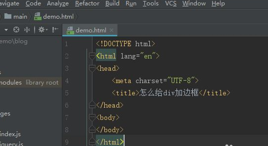
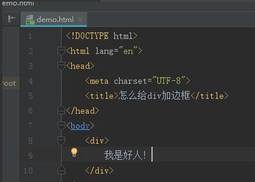
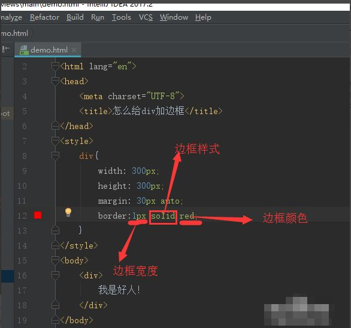
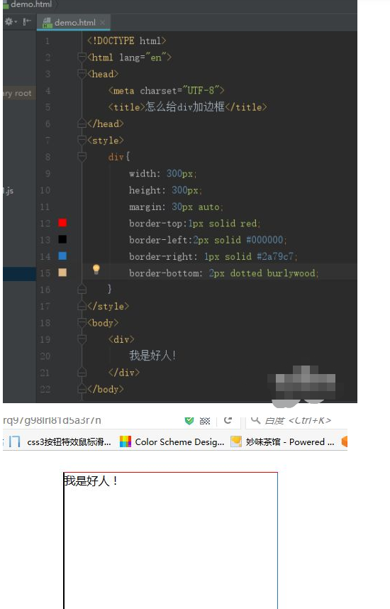

# div加边框

如何给div加边框呢？想必一定遇到过这个问题，那怎么办呢?

## 材料/工具

编辑器WS，DW，IDEA

## 方法

- 1*/*4

  新建一个【HTML页面】。

  

- 2*/*4

  在HTML的中【<body>】写上【
】标签，打开浏览器会有对应的效果图。

  

- 3*/*4

  两种增加样式方法:
  统一设置边框样式。

  

- 4*/*4

  分别设置边框样式，规则还是一样的。

  