# 项目代码行数统计

### 一、git命令统计

##### 1、统计某人代码提交量

```
git log --author="mengfanxiao" --pretty=tformat: --numstat | awk '{ add += $1; subs += $2; loc += $1 - $2 } END { printf "added lines: %s, removed lines: %s, total lines: %s\n", add, subs, loc }' -
```

##### 2、统计所有人代码提交量（指定统计提交文件类型）

```
git log --format='%aN' | sort -u | while read name; do echo -en "$name\t"; git log --author="$name" --pretty=tformat: --numstat | grep "\(.html\|.java\|.xml\|.properties\|.css\|.js\|.txt\)$" | awk '{ add += $1; subs += $2; loc += $1 - $2 } END { printf "added lines: %s, removed lines: %s, total lines: %s\n", add, subs, loc }' -; done
```

##### 3、统计某时间范围内的代码提交量

```
git log --author=mengfanxiao --since=2019-01-01 --until=2021-02-01 --format='%aN' | sort -u | while read name; do echo -en "$name\t"; git log --author="$name" --pretty=tformat: --numstat | grep "\(.html\|.java\|.xml\|.properties\)$" | awk '{ add += $1; subs += $2; loc += $1 - $2 } END { printf "added lines: %s, removed lines: %s, total lines: %s\n", add, subs, loc }' -; done
```

```
结果：added lines: 106243, removed lines: 14088, total lines: 92155
```

##### 4、查看git提交前5名

```
git log --pretty='%aN' | sort | uniq -c | sort -k1 -n -r | head -n 5
```

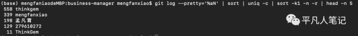

##### 5、贡献值统计

```
git log --pretty='%aN' | sort -u | wc -l
```

##### 6、提交数统计

```text
git log --oneline | wc -l
```

##### 7、统计或修改的行数

```
git log --stat|perl -ne 'END { print $c } $c += $1 if /(\d+) insertions/'
```

### 二、idea statstic 统计

#### 1、安装statstic插件


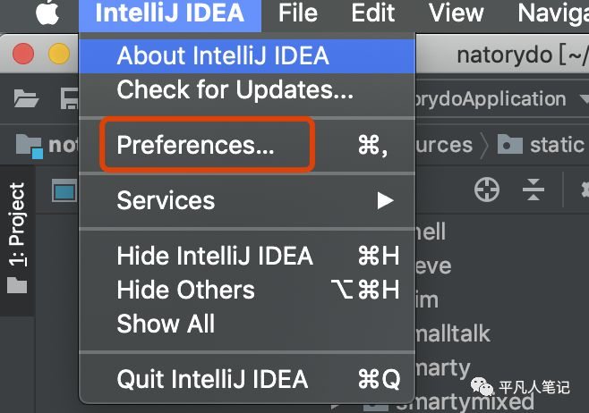


#### 2、安装插件


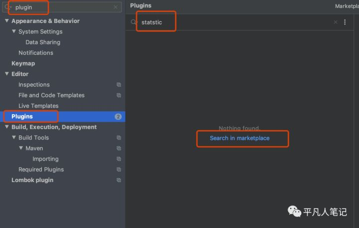


#### 3、已安装好的效果 然后重启下idea


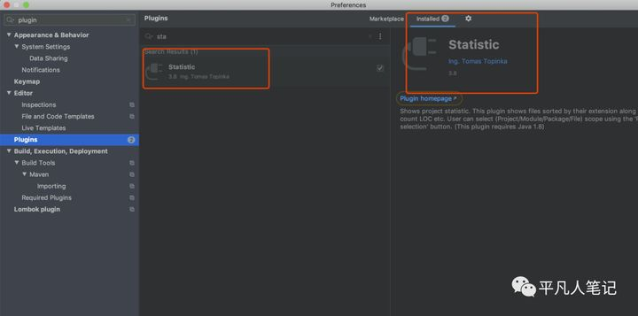


#### 4、重启了之后 就会出现stastic 选中要查看的代码 点击 refresh on selection


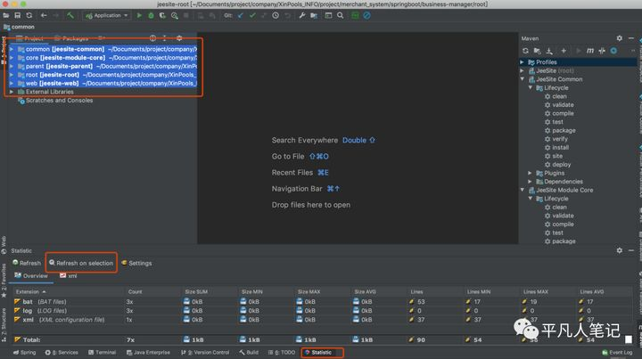


#### 5、overview是全部文件 其他的tab页签 如css html java js properties txt xml 可以配置


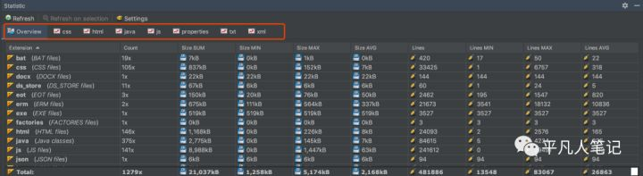


#### 6、配置方式

##### 1）点击settings


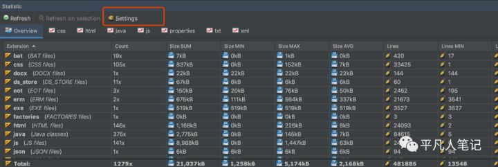


##### 2）配置文件类型


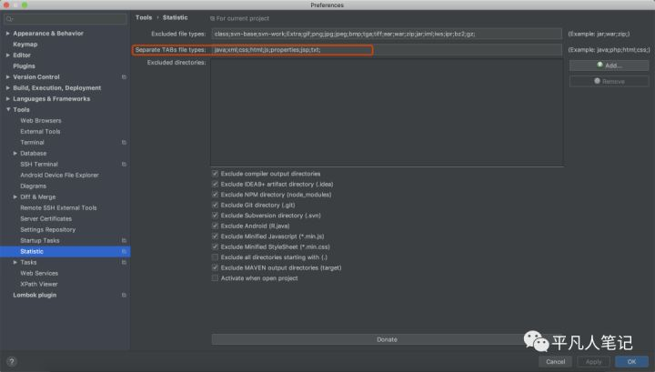


### 三、gitstat （感觉最有意思的方式）

```text
git clone git://github.com/hoxu/gitstats.git
cd gitstats./gitstats 你的项目的位置 生成统计的文件夹位置可能会提示没有安装gnuplot画图程序，那么需要安装再执行：//mac osx
brew install gnuplot
//centos linuxyum install gnuplot用mac brew安装的时候 速度可能很慢 处理方式更换国内阿里云上的homebrew镜像：# 替换brew.git:cd "$(brew --repo)"git remote set-url origin https://mirrors.aliyun.com/homebrew/brew.git# 替换homebrew-core.git:cd "$(brew --repo)/Library/Taps/homebrew/homebrew-core"git remote set-url origin https://mirrors.aliyun.com/homebrew/homebrew-core.git# 替换homebrew-bottles:echo 'export HOMEBREW_BOTTLE_DOMAIN=https://mirrors.aliyun.com/homebrew/homebrew-bottles' >> ~/.zshrcsource ~/.zshrc切换好安装源之后 再使用brew命令就会分块安装好之后 执行命令就会生成html文档访问页面 首先看到项目概括 总文件、代码总行数、总提交次数、多少个作者提交记录
```

作者提交记录统计


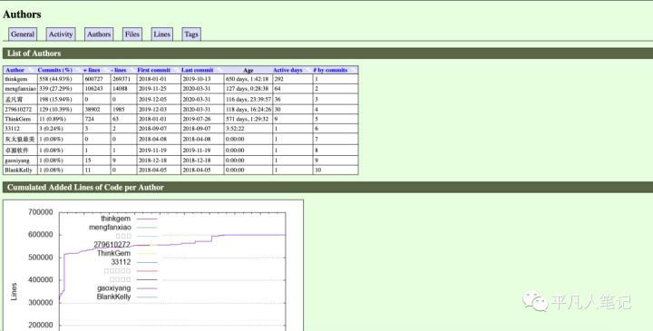


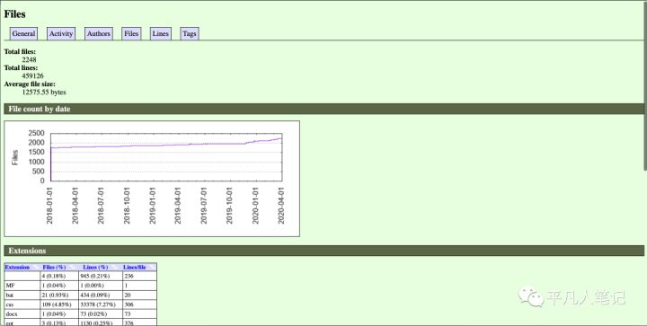


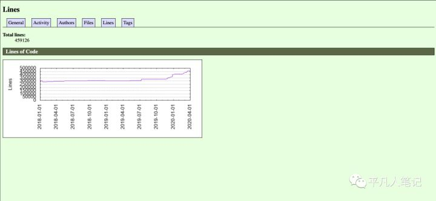


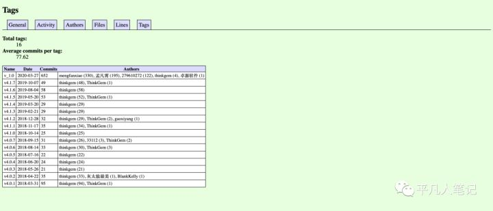


### 四、使用 cloc

#### 1、brew install cloc


#### 2、统计当前文件夹代码量


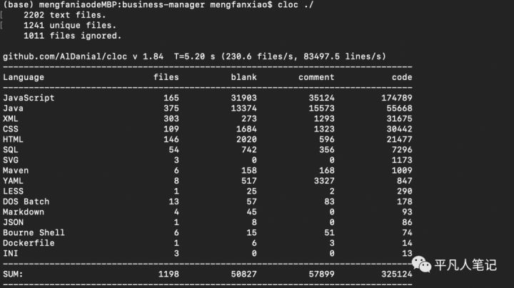


#### 3、统计排除当前目录下的某个文件夹的代码量（这里以Pods文件夹为例）

```
cloc ./ --exclude-dir=Pods
```

3、统计特定文件的代码量（这里以acpi为例）

```
cloc -by-file acpi
```

#### 4、帮助文档

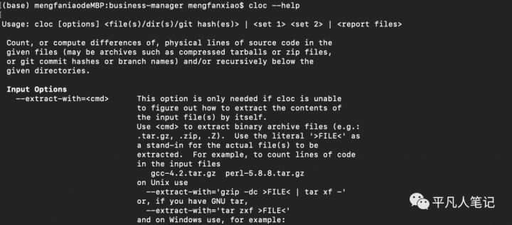